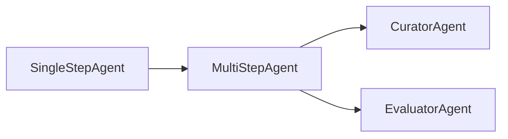

# Agent Types and Concepts

FastMCP-Agents provides a flexible framework for building AI agents that can interact with MCP servers and their tools. This document describes the core agent types and concepts that are fundamental to developing agents with FastMCP-Agents.

The following diagram illustrates the inheritance hierarchy of the core agent types:

## Core Agent Types

FastMCP-Agents provides several base classes for creating agents, each offering different levels of functionality and complexity:

### `SingleStepAgent`

The `SingleStepAgent` is the most basic agent type. It is designed to perform a single interaction with the LLM and execute the resulting tool calls. It does not manage conversation history across multiple turns.

*   **Key Characteristics:**
    *   Performs a single LLM call per invocation.
    *   Executes tool calls requested by the LLM in that single turn.
    *   Does not maintain conversation history internally.
    *   Suitable for simple tasks that can be completed in one turn.

*   **Core Methods:**
    *   `__init__(name, description, system_prompt, instructions, default_tools, llm_link)`: Initializes the agent with its identity, instructions, tools it can use, and the LLM connection.
    *   `call_tool(tool_call_request, fastmcp_tool)`: Executes a single tool call request.
    *   `call_tools(tool_call_requests, fastmcp_tools)`: Executes a list of tool call requests in parallel.
    *   `pick_tools(conversation, tools)`: Sends the current conversation to the LLM and requests tool calls.
    *   `run_step(ctx, conversation, task, tools)`: Orchestrates a single turn of the agent, which involves picking tools and then calling them.

### `MultiStepAgent`

The `MultiStepAgent` extends `SingleStepAgent` by adding the capability to manage conversation history and execute multiple steps (turns) with the LLM. This allows for more complex tasks that require a back-and-forth interaction until a task is completed or a step limit is reached.

*   **Key Characteristics:**
    *   Maintains conversation history.
    *   Can execute multiple steps with the LLM.
    *   Includes built-in mechanisms for the LLM to report task success or failure using `report_success` and `report_failure` tools.
    *   Suitable for tasks requiring iterative refinement or multiple tool interactions.

*   **Core Methods:**
    *   `__init__(system_prompt, step_limit)`: Initializes the agent with a system prompt and a maximum number of steps it can take. Inherits other parameters from `SingleStepAgent`.
    *   `run_steps(ctx, task, conversation, tools, step_limit, success_response_model, error_response_model)`: The main method to execute the multi-step process, managing the conversation and calling `run_step` for each turn until a success or failure is reported.

### `CuratorAgent`

The `CuratorAgent` is a concrete implementation of `MultiStepAgent` designed to act as an interface between a remote user/agent and the tools available on a FastMCP Server. It provides methods for performing tasks and managing its instructions.

*   **Key Characteristics:**
    *   Extends `MultiStepAgent` with a specific system prompt for tool curation.
    *   Acts as a primary agent for exposing server tools.

*   **Core Methods:**
    *   `perform_task_return_conversation(ctx, task)`: Performs a task using the agent's instructions and returns the full conversation history along with the result.
    *   `perform_task(ctx, task)`: Performs a task and returns only the result string, raising an error if the task fails.
    *   `change_instructions(instructions)`: Dynamically updates the agent's instructions.
    *   `get_instructions()`: Retrieves the agent's current instructions.

### `EvaluatorAgent`

The `EvaluatorAgent` is a concrete implementation of `MultiStepAgent` specialized in evaluating the final work product of another agent against a defined goal and criteria. It provides a structured way to score and provide feedback on results.

*   **Key Characteristics:**
    *   Extends `MultiStepAgent` with a system prompt and default instructions tailored for evaluation.
    *   Provides a structured output for evaluation results, including scores and feedback.

*   **Core Methods:**
    *   `evaluate_result(ctx, task, proposed_solution, conversation)`: Evaluates a proposed solution for a given task, taking into account the conversation history, and returns a detailed `EvaluationResult`.
